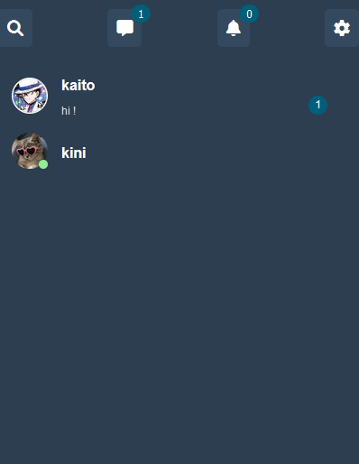
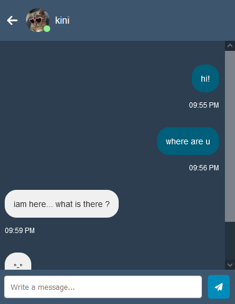
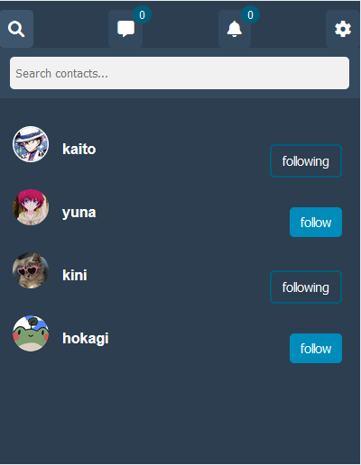
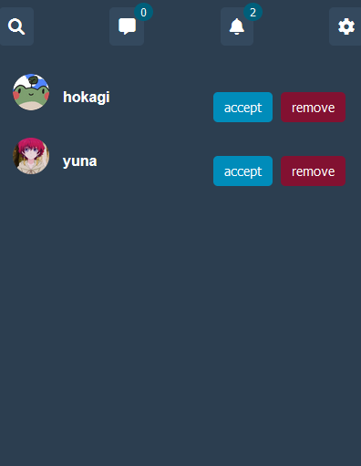
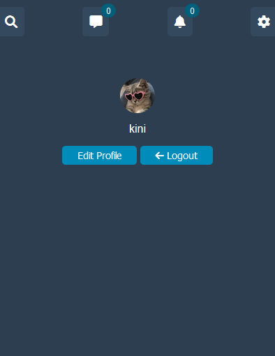

# Django chat pplication:
this is a friendly chat application build using django . it allows you to send and receive messages with your friends as you like.
# Features:
- user authentication(signup, login, logout, reset password)
- manage user profile(change user thumbnail)
- send message, receive message
- messages notification
- search for friend 
  follow friend
- unfollow friend
- notification for request friend
- accept request friend
- delete request friend
# Technologies used :
- Python
- Django
- Django channels
- Web Socket
- PostgreSQL
- HTML
- CSS
# Installation:
1. Clone the repository:
```
https://github.com/KhadijaAbdeLouassaa/chat-application.git
```
2. Create virtual environment:
```
pip install virtualenv
virtualenv env
```
3. Activate virtual environment:
```
env\scripts\activate
```
4. Install requirements:
```
pip install -r requirements.txt
```
5. Migrate Database:
```
py manage.py makemigrations
py manage.py migrate
```
6. Runing server:
```
py manage.py runserver
```
## home page :

## chats page :

## search page :

## notification page :

## settings page :

